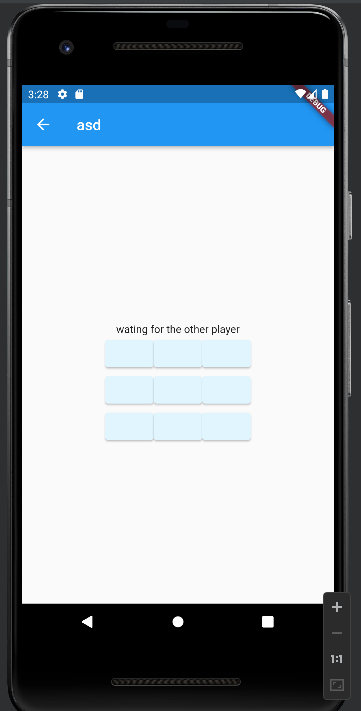
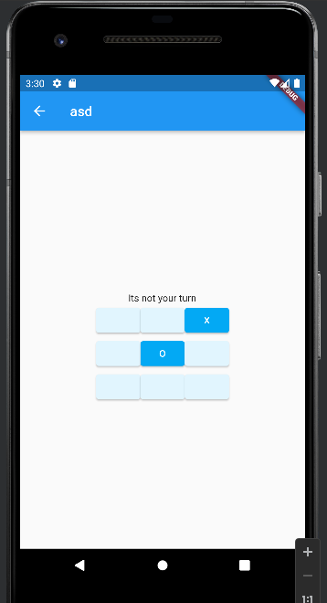

# Tic Tac Toe App with Serverless Architecture

Welcome to the Tic Tac Toe App repository! This project showcases a fully serverless architecture implemented with AWS services and developed using the Flutter framework.
Below, you'll find a comprehensive guide on the project structure, backend logic, and key components.




## Overview

This Tic Tac Toe App allows users to register and log in, create online game rooms, and engage in Tic Tac Toe matches with other registered users. 
The serverless architecture leverages AWS services, including Cognito for user authentication, DynamoDB for game data storage, Lambda functions for backend logic, and API Gateway for WebSocket communication.

## Key Components

### Backend (AWS Lambda Functions in Python)

#### 1. `create_game_lambda.py`
   - **Description**: Handles the creation of new game rooms and player connections.
   - **Integration**: DynamoDB is used to store game data, and AWS API Gateway manages WebSocket communication.

```python
# ...

# Integration with DynamoDB
dynamodb = boto3.resource("dynamodb")
games_table = dynamodb.Table(os.environ.get('TicTacToeGames'))
activePlayersTable = dynamodb.Table(os.environ.get('TicTacToeActivePlayers'))

# Check if the game code is already taken
response = games_table.get_item(Key={"code": code})
if "Item" in response:
    return {"statusCode": 200, "code": "taken"}
else:
    # Create a new game and update active players table

# WebSocket communication with the client
client.post_to_connection(ConnectionId=connectionId, Data=data_bytes)

# ...
```

#### 2. `signup_lambda.py`
   - **Description**: Handles user registration using AWS Cognito.
   - **Integration**: Integrates with Cognito for user signup.

```python
# Integration with Cognito for user signup

response = client.sign_up(ClientId=clientId, Username=mail, Password=password)

# Handle different responses (e.g., success, existing username, error)
```

### Frontend (Flutter)

#### 1. `Board.dart`
   - **Description**: Flutter widget for the Tic Tac Toe game board.
   - **Integration**: Utilizes a WebSocket channel to communicate with the backend.

```dart
// Sample code from Board.dart
// ...

class Board extends StatefulWidget {
  // ...

  @override
  State<Board> createState() => _GameState();
}

class _GameState extends State<Board> {
  late WebSocketChannel channel;

  // WebSocket connection initialization
  @override
  void initState() {
    // ...
    channel = WebSocketChannel.connect(Uri.parse('wss://...'));
  }

  // ...

  // Build method includes UI elements and WebSocket communication
  @override
  Widget build(BuildContext context) {
    // ...
    StreamBuilder(
      stream: channel.stream,
      builder: (context, snapshot) {
        // Process data received from the backend
        // Update UI elements accordingly
      },
    );
    // ...
  }

  // WebSocket message sending
  void sendMessage(int place) {
    channel.sink.add(json.encode({"action": "play", "code": code, "place": place}));
  }

  // ...
}
```


## Getting Started

To run the Tic Tac Toe App locally, follow these steps:

1. Set up AWS services: Create Cognito User Pools, DynamoDB tables, Lambda functions, and API Gateway.
2. Update environment variables in Lambda functions and Flutter code with your AWS configuration.
3. Install Flutter and dependencies.
4. Run the Flutter app locally.

## License

This project is free for evrybody to use

Feel free to explore, contribute, and enjoy playing Tic Tac Toe! If you have any questions or suggestions, please open an issue or reach out to the project maintainers. Happy coding!
